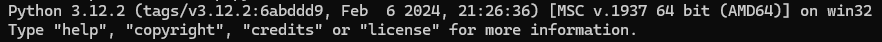

## Instructions on how to run the python script `rv.py`

1. Make sure that you have Python installed on your machine.
    - Open a terminal and type `Python` or `py`.
    - If Python is installed you will get the following or similar message.
    
2. The necessary library must be installed. Type `pip install colorama`.
3. To run the script itself just type `python .\scripts\your_script.py `.

***The script runs automatically and no further user inputs are required.***